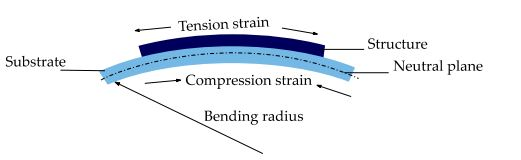
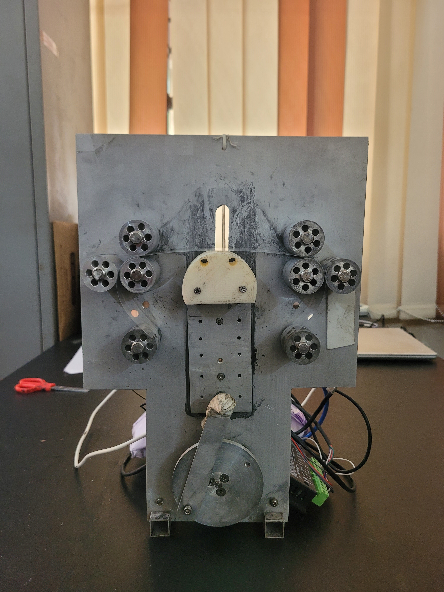
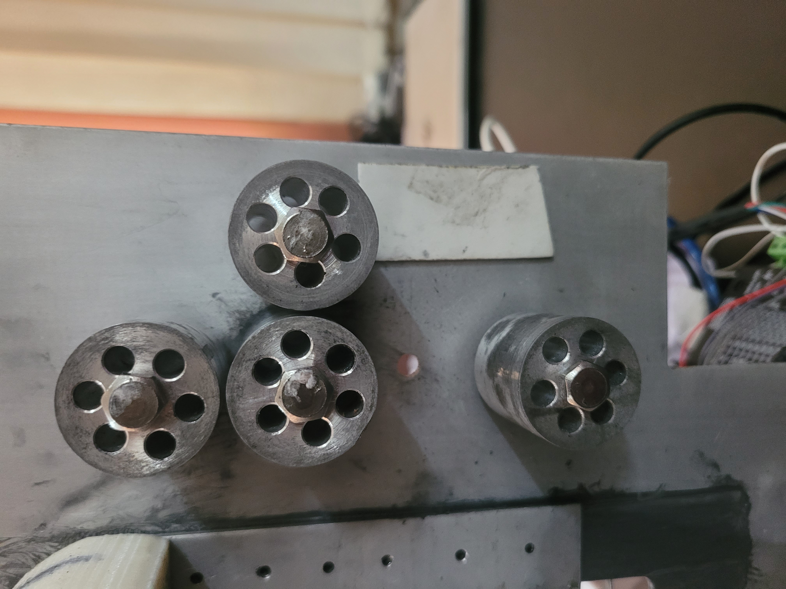
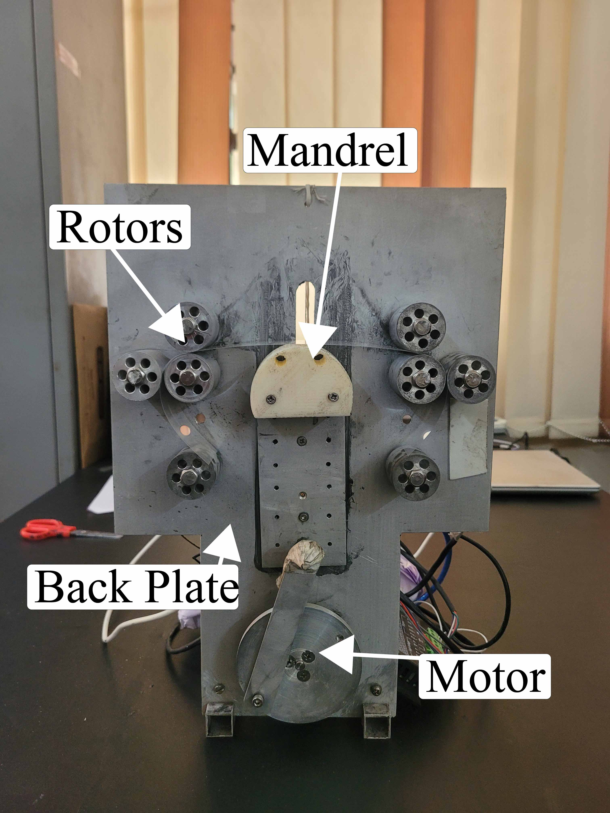

# Building a Bending Machine for Material Characterization

## Abstract

This project involves the creation of a custom bending machine for evaluating the mechanical and electrical reliability of printed electronics under repetitive stress. The machine integrates precision hardware, stepper motor control via Arduino, and a Keithley 2100 multimeter for resistance measurement. These tests simulate real-world mechanical stresses, providing insights into the durability of flexible electronics for applications like wearable devices and foldable technologies.

---

## Introduction

Flexible electronics are pivotal in modern technologies such as wearable devices and foldable displays. Ensuring their reliability under mechanical stress is crucial. This project builds upon existing methodologies to develop a bending machine that facilitates material reliability testing under controlled conditions.

*Figure 1: Bending mechanism.*

Flexible materials experience tensile and compressive stress during bending, with performance influenced by factors like bending radius and cycle count. Studies like Kreiml et al. (2018) and Kim et al. (2018) underscore the importance of controlled testing to assess material durability.

---

## Methodology

### 1. Hardware Manufacturing

The bending machine's hardware components were fabricated using:
- **Lathe Milling:** Aluminum rotors were precision-machined.
- **CNC Drilling:** Plates and mandrels were drilled with high precision.
- **3D Printing:** Custom connectors and supports were created.

### 2. Stepper Motor and Arduino Integration

- A stepper motor was controlled using Arduino to ensure precise motion.
- A limit switch was installed to count completed bending cycles.

### 3. Resistance Measurement

Resistance was recorded at each bending stage using a Keithley 2100 multimeter, interfaced with a Python script for data logging.

---

## Results

### Key Features of the Bending Machine

- **Bending Radius:** Adjustable to test different stress levels.
- **Cycle Count Accuracy:** Real-time logging ensures reliable data.
- **Data Collection:** Integrated resistance measurements provide insights into material degradation.

### Assembly and Design

*Figure 2: Front view of the machine.*

*Figure 3: Rotos.*

*Figure 4: Components used in the machine.*

---

## Conclusion

This bending machine enables the accurate and repeatable testing of flexible electronics, providing critical data on mechanical reliability. By combining precision hardware with automated data collection, this project contributes to advancements in the durability of emerging flexible technologies.

---
- The link [here](Mes 2.py) will redirect users to the file in your repository.

---
## References

1. Kreiml et al., 2018 - *Universal bending apparatus for flexible electronics testing.*
2. Kim et al., 2018 - *Durability assessment of foldable technologies.*
3. Saleh et al., 2021 - *Resistance changes in printed RFID antennas under bending stress.*
